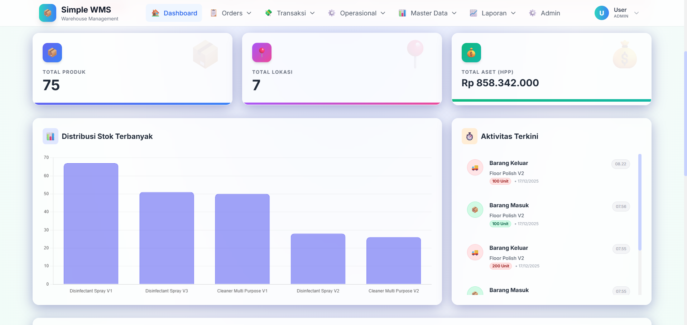
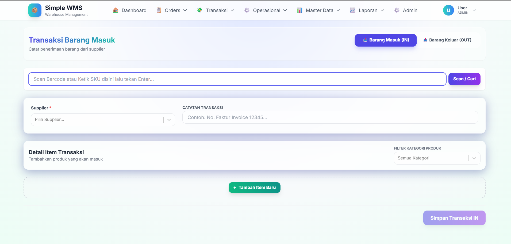
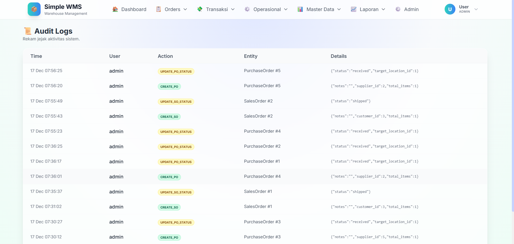

# 🏭 Sistem Manajemen Gudang Modern (WMS)

> Solusi manajemen inventaris full-stack dan real-time yang dibangun untuk operasional logistik modern. Dilengkapi fitur pelacakan batch canggih, akuntansi biaya FIFO, dan analitik dashboard langsung.

**[🚀 Demo Langsung (Live Demo)](https://wms-project-4dtd.vercel.app/)**

> **Login Demo:** `admin` / `password123`



## 🌟 Fitur Utama

### 📦 Kontrol Inventaris Canggih

- **Pelacakan Batch & Kedaluwarsa**: Pantau kesegaran stok dengan pelacakan tingkat batch yang presisi.
- **Biaya FIFO & Rata-rata**: Perhitungan HPP (Harga Pokok Penjualan) otomatis menggunakan logika First-In-First-Out dan Moving Average.
- **Stok Opname**: Rekonsiliasi digital antara stok fisik vs sistem dengan jejak audit.
- **Peringatan Stok Rendah**: Notifikasi real-time saat inventaris turun di bawah ambang batas aman.

### 🔄 Manajemen Pesanan

- **Purchase Orders (PO)**: Siklus pengadaan lengkap dari Draft -> Submitted -> Received.
- **Sales Orders (SO)**: Pemenuhan pesanan yang efisien dengan pengurangan stok otomatis dan pembaruan status.
- **Penerimaan & Pengiriman Barang**: Pengecekan validasi untuk mencegah pengiriman stok yang kedaluwarsa atau terkunci.

### 📊 Analitik Real-Time

- **Dashboard Langsung**: Pembaruan berbasis WebSocket untuk aktivitas masuk/keluar.
- **Laporan Keuangan**: Laporan HPP, Laba Kotor, dan Valuasi Inventaris.
- **Riwayat Pergerakan**: Pelacakan lengkap setiap item yang bergerak melalui gudang.

## 🛠️ Stack Teknologi

**Frontend:**

- **React 18**: UI berbasis komponen dengan Hooks.
- **Vite**: Build tool super cepat.
- **Tailwind CSS**: Styling utility-first modern.
- **Chart.js**: Visualisasi data interaktif.
- **Socket.io Client**: Penanganan event real-time.

**Backend:**

- **Node.js & Express**: Arsitektur REST API yang tangguh.
- **PostgreSQL**: Database relasional untuk pemodelan data kompleks.
- **Knex.js**: SQL Query Builder & Manajer Migrasi.
- **Socket.io**: Komunikasi real-time server-client.
- **Joi**: Skema & Validasi Data.

## 🚀 Memulai (Getting Started)

Ikuti langkah-langkah berikut untuk menjalankan proyek ini di lokal komputer Anda.

### Prasyarat

- Node.js (v18+)
- PostgreSQL (v14+)
- npm atau yarn

### Instalasi

1.  **Clone repositori**

    ```bash
    git clone https://github.com/ARVIN1006/wms-fullstack-project.git
    cd wms-fullstack-project
    ```

2.  **Setup Backend**

    ```bash
    cd wms-backend
    npm install

    # Setup Environment Variables
    cp .env.example .env
    # Update .env dengan kredensial PostgreSQL Anda

    # Jalankan Migrasi & Seed Data
    npm run migrate
    npm run seed

    # Jalankan Server
    npm run dev
    ```

3.  **Setup Frontend**

    ```bash
    cd ../wms-frontend
    npm install
    npm run dev
    ```

4.  **Akses Aplikasi**
    Buka `http://localhost:5173` di browser Anda.
    - **Login Admin Default**: `admin` / `password123`

## 📸 Tangkapan Layar (Screenshots)

| Dashboard                            | Daftar Stok                              |
| ------------------------------------ | ---------------------------------------- |
|  |  |

| Formulir Pesanan                       | Log Audit                             |
| -------------------------------------- | ------------------------------------- |
|  |  |

## 🤝 Kontribusi

Kontribusi sangat diterima! Silakan jalankan test suite sebelum mengirimkan Pull Request.

## 📄 Lisensi

Proyek ini dilisensikan di bawah Lisensi MIT - lihat file [LICENSE](LICENSE) untuk detailnya.

---

_Dibuat dengan ❤️ oleh Arvin_
